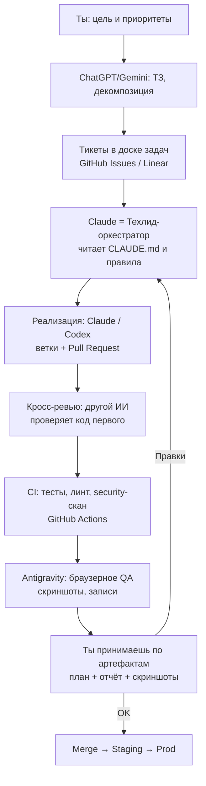

# AI-команда разработки: Playbook

**Для кого:** основатель-оркестратор (ты управляешь, не пишешь код сам).
**Цель:** собрать «AI IT-компанию» из подписок Claude, Codex, Antigravity, Gemini, ChatGPT, которая автономно ведёт разработку продукта (включая `topdim`), а ты выступаешь CEO/техлидом и контролируешь качество.
**Дата:** 30 июня 2026.

---

## 0. Главное за 60 секунд (TL;DR)

1. **«Команда» из ИИ — это не магия интеграции, а оркестрация.** Эти инструменты НЕ общаются между собой напрямую. Они работают вместе только потому, что у них общий «офис»: один Git-репозиторий, одна доска задач и одинаковые контекст-файлы. Это и есть твоя первая задача — построить «офис», а не подключать агентов.
2. **Сначала фундамент, потом агенты.** Git + правила/контекст + доска задач + CI (автопроверки) + staging. Без этого армия агентов превратит проект в хаос за неделю.
3. **Один оркестратор, не пять.** Назначь Claude главным «техлидом-дирижёром». Остальные — специалисты, которых он (и ты) подключаешь под задачу.
4. **Раз ты не кодишь — качество держат автоматы, а не твои глаза.** Тесты, CI-гейты, кросс-ревью одним ИИ кода другого ИИ, браузерное QA и staging. Ты принимаешь работу по понятным артефактам (план, скриншоты, отчёт), а не по строкам кода.
5. **Двигайся фазами.** Сначала проведи ОДНУ фичу через весь конвейер вручную-полуавтоматически. Только потом включай параллелизм и автоматизацию.

---

## 1. Ментальная модель: ты строишь компанию, а не «подключаешь ИИ»

Представь обычную IT-компанию. В ней людей объединяет не телепатия, а процессы: общий репозиторий кода, таск-трекер, код-ревью, CI/CD, требования (ТЗ). Убери людей, поставь на их места ИИ-агентов — и тебе нужны ровно те же процессы.

Поэтому правильный вопрос не «как заставить Claude и Codex общаться?», а **«какой у них общий источник правды и как устроен конвейер?»**.

Единый источник правды (Single Source of Truth) = **Git-репозиторий + тикеты (задачи) + контекст-файлы**. Любой агент:
- читает задачу из тикета,
- читает правила проекта из контекст-файла,
- делает ветку и Pull Request,
- другой агент его ревьюит,
- CI прогоняет тесты,
- ты принимаешь по отчёту.

Всё. Это и есть «настоящая IT-компания».

---

## 2. Орг-структура: кто за что отвечает

Каждый инструмент силён в своём. Не используй их как пять одинаковых «кодеров» — это потеря денег и качества. Распределение ролей:

| Роль в «компании» | Инструмент | Почему он | Что делает на практике |
|---|---|---|---|
| **CEO / Заказчик** | **Ты** | Стратегия и приёмка | Ставишь цели, расставляешь приоритеты, принимаешь/отклоняешь работу по артефактам |
| **Продакт / Аналитик** | **ChatGPT (GPT‑5.x)** | Сильный в продуктовом мышлении и тексте | Идея → ТЗ/PRD, пользовательские истории, декомпозиция на задачи, маркетинг-тексты |
| **Исследователь / Дизайн‑в‑код** | **Gemini (3, 1M контекст)** | Огромный контекст + мультимодальность + Google-grounding | Анализ больших объёмов (весь репозиторий целиком, длинные доки), research рынка, превращение макета/скриншота в требования |
| **Техлид / Архитектор / Оркестратор + Ревьюер** | **Claude (Claude Code / Cowork)** | Уже настроен под `topdim` (`CLAUDE.md`, правила), силён в архитектуре и аккуратности, умеет суб-агентов и «команды агентов» | Главный дирижёр: бьёт задачу на части, пишет/правит код, ревьюит чужой код, держит стандарты |
| **Старший автономный инженер** | **Codex (GPT‑5.x CLI/app)** | Длинные автономные цепочки, параллельные worktrees, встроенный ревью-агент | Тащит фичу целиком, гоняет тесты, рефакторит; параллельно несколько задач в изолированных копиях репо |
| **QA-инженер / Визуальный цех** | **Antigravity 2.0** | Manager-поверхность для нескольких агентов + браузерный сабагент, который реально кликает по приложению и тестирует | Оркестрация нескольких агентов визуально, авто-тестирование UI в реальном Chrome, артефакты (скриншоты, записи) для твоей приёмки |

> Это распределение — отправная точка, а не догма. Если у какого-то инструмента нет нужного доступа (см. §7 про Gemini CLI), его роль легко переносится на соседа.

---

## 3. Как они работают вместе (схема конвейера)



**Клей, который всё связывает (то, что нужно настроить):**

1. **Git/GitHub** — общий код, ветки, Pull Request'ы. Сердце системы.
2. **Доска задач** — GitHub Projects (бесплатно, рядом с кодом) или Linear. Тикет = единица работы для агента.
3. **Контекст-файлы** — одинаковые «правила игры», которые читает каждый агент:
   - `CLAUDE.md` — для Claude (у тебя уже есть, и очень хороший).
   - `AGENTS.md` — стандарт, который читают Codex и большинство CLI-агентов.
   - `GEMINI.md` — для Gemini-агента.
   - Держи их **синхронными** (один смысл, три файла). Это критично: иначе агенты будут противоречить друг другу.
4. **MCP (Model Context Protocol)** — общий «разъём», через который агенты ходят в одни и те же сервисы (GitHub, доска задач, база и т.д.). Все пять экосистем его поддерживают — это и есть техническая основа их совместной работы.
5. **CI/CD (GitHub Actions)** — автоматический контролёр: ни один PR не вливается, пока не зелёные тесты.

---

## 4. Что настроить в первую очередь (по фазам)

Не делай всё сразу. Порядок важнее скорости.

### Фаза 0 — Фундамент (до агентов)
- [ ] Репозиторий на GitHub (у тебя есть `topdim`), включи защиту ветки `main`: merge только через PR и только при зелёном CI.
- [ ] Доска задач: GitHub Projects, колонки `Backlog → To do → In progress → Review → Done`.
- [ ] Контекст-файлы: оставь `CLAUDE.md`, добавь `AGENTS.md` и `GEMINI.md` с тем же содержанием (попроси Claude сгенерировать их из `CLAUDE.md`).
- [ ] CI на GitHub Actions: сборка + тесты + линт на каждый PR (попроси Claude написать workflow).
- [ ] Секреты — только в GitHub Secrets / менеджере секретов. Никогда не в чат и не в репозиторий (это прямо записано в твоих правилах безопасности).
- [ ] Staging-окружение (даже простой Docker Compose уже есть в проекте) — чтобы смотреть результат до прода.

### Фаза 1 — Пилот: одна фича сквозь весь конвейер
- [ ] Выбери Claude главным оркестратором (ты уже в нём, и репо под него настроен).
- [ ] Возьми ОДНУ маленькую фичу. Пройди весь путь: ТЗ → тикет → ветка → PR → ревью → тесты → merge.
- [ ] Цель фазы — не фича, а **отлаженный процесс**.

### Фаза 2 — Контроль качества
- [ ] Кросс-ревью: код, написанный Claude, ревьюит Codex (и наоборот). Разные модели ловят разные ошибки.
- [ ] Обязательные тесты на каждую бизнес-логику (особенно негативные кейсы — у тебя это в правилах тестирования).
- [ ] CI-гейт: красный CI = PR не вливается. Без исключений.

### Фаза 3 — Параллелизм (масштабирование «команды»)
- [ ] Codex worktrees / Claude Agent Teams / Antigravity Manager — несколько агентов на разных задачах одновременно, каждый в своей изолированной копии.
- [ ] Antigravity подключаешь для визуального QA: он реально открывает приложение в браузере и проверяет, что кнопки работают.

### Фаза 4 — Автоматизация рутины
- [ ] Расписания: ночной прогон тестов, авто-ревью свежих PR, утренний дайджест «что сделано / что висит».
- [ ] Авто-триаж задач: входящий запрос → черновик тикета.

---

## 5. Контроль качества, когда ты не читаешь код

Это самый важный раздел лично для тебя. Раз ты не проверяешь код глазами, качество должны держать **автоматические ворота** и **понятные артефакты**.

**5 ворот, через которые проходит любая работа:**
1. **Definition of Done в тикете.** Каждая задача описана так, что «готово» можно проверить без чтения кода: что пользователь должен увидеть/смочь.
2. **Тесты.** Агент обязан написать тесты, включая негативные сценарии. Нет тестов — задача не принята.
3. **CI зелёный.** Сборка, тесты, линт, security-скан прошли автоматически.
4. **Кросс-ревью вторым ИИ.** Независимый агент пишет понятный отчёт: что изменено, какие риски, всё ли покрыто. Ты читаешь отчёт, а не diff.
5. **Браузерное/визуальное QA + staging.** Antigravity (или ручной просмотр на staging) показывает работающий результат скриншотами/записью. Ты принимаешь глазами по продукту, а не по коду.

**Как ты принимаешь работу:** агент приносит тебе три артефакта на человеческом языке — *план*, *что сделано и почему*, *доказательства (скриншоты/тесты)*. Если что-то не так — пишешь правку текстом, цикл повторяется.

> Золотое правило не-кодера: **никогда не разрешай агенту лить в прод напрямую**. Только через PR → CI → staging → твоя приёмка.

---

## 6. Что понадобится (чек-лист)

**Уже есть:** подписки Claude, Codex/ChatGPT, Gemini, Antigravity; проект `topdim` (Java/Spring, Docker Compose).

**Нужно добавить/настроить:**
- [ ] **GitHub** (репозиторий + Projects + Actions + Secrets) — бесплатно для старта.
- [ ] **Desktop/CLI-приложения** агентов: Claude Code, Codex (app/CLI), Antigravity (desktop-приложение — самое наглядное для тебя).
- [ ] **MCP-серверы**: как минимум GitHub MCP (чтобы агенты читали/писали задачи и PR). Подключается к каждому агенту.
- [ ] **Контекст-файлы**: `CLAUDE.md`, `AGENTS.md`, `GEMINI.md` (синхронные).
- [ ] **Менеджер секретов**: GitHub Secrets для CI; локально — `.env`, который агентам трогать запрещено.
- [ ] **Staging**: дешёвый VPS/облако или локальный запуск через имеющийся Docker Compose.
- [ ] (Опц.) **Linear** вместо GitHub Projects, если хочешь более удобную доску.

---

## 7. Риски и ограничения (читать обязательно)

- **Они не интегрируются «из коробки».** Совместная работа = твоя настройка общего репо, тикетов, контекст-файлов и MCP. Магической кнопки «объединить 5 ИИ» нет.
- **⚠️ Доступ к Gemini CLI.** В июне 2026 Google закрыл бесплатный/потребительский доступ к Gemini CLI для большинства пользователей (остался enterprise). Проверь, что входит в ТВОЮ подписку. Если CLI недоступен — используй Gemini через приложение/AI Studio для research, анализа большого контекста и работы с макетами, а кодовую автономку отдай Codex и Claude.
- **Дрейф контекста.** Если `CLAUDE.md`/`AGENTS.md`/`GEMINI.md` разойдутся, агенты начнут противоречить. Держи их синхронными.
- **Галлюцинации и тихие баги.** Раз ты не читаешь код — это ловят тесты, кросс-ревью и staging. Не ослабляй гейты ради скорости.
- **Безопасность.** Авторизация, JWT, платежи, купоны — зоны повышенного риска (по твоим правилам). Любые изменения тут — обязательно ревью вторым агентом + негативные тесты на replay/двойное списание/гонки.
- **Стоимость.** Параллельные агенты быстро жгут лимиты. Включай параллелизм только после Фазы 2.
- **Неover-автоматизируй рано.** Сначала один отлаженный поток, потом масштаб.

---

## 8. Первые 7 дней (пошагово)

- **День 1.** Включи защиту ветки `main` + заведи GitHub Projects. Попроси Claude сгенерировать `AGENTS.md` и `GEMINI.md` из `CLAUDE.md`.
- **День 2.** Попроси Claude написать CI-workflow (сборка + тесты + линт) и завести его в `.github/workflows`. Проверь, что на тестовом PR CI краснеет/зеленеет.
- **День 3.** Подключи GitHub MCP к Claude и Codex (чтобы видели задачи и PR).
- **День 4.** Возьми одну маленькую фичу. С ChatGPT напиши ТЗ → заведи тикет.
- **День 5.** Claude реализует фичу в отдельной ветке и открывает PR.
- **День 6.** Codex делает кросс-ревью PR; Claude правит замечания; CI зелёный.
- **День 7.** Antigravity (или ты на staging) проверяет результат визуально → merge. Запиши, что в процессе было неудобно — это твой бэклог улучшений «фабрики».

К концу недели у тебя есть рабочий конвейер на одной фиче. Дальше — повторять и параллелить.

---

## 9. Готовые шаблоны (копируй и используй)

### 9.1. Шаблон тикета (Definition of Done)
```
Заголовок: <что делаем>
Контекст: <зачем, какая проблема>
Готово, когда:
  - [ ] Пользователь может <конкретное наблюдаемое поведение>
  - [ ] Есть тесты: happy-path + негативные (невалидный ввод, нет сущности, нет прав, дубль)
  - [ ] CI зелёный
  - [ ] Не меняет публичный API без явной пометки
Затрагивает сервисы: <...>
Риски безопасности: <auth/payment/coupon? если да — обязателен кросс-ревью>
```

### 9.2. Промпт оркестратору (Claude как техлид)
```
Ты — техлид проекта topdim (Java 21 / Spring Boot, микросервисы).
Следуй CLAUDE.md и правилам в .claude/rules.
Задача (тикет): <вставь тикет>
Сделай:
1. Объясни текущий флоу и затронутые файлы.
2. Назови риски и edge-cases.
3. Предложи план (маленькие шаги).
4. Реализуй в отдельной ветке, открой PR.
5. Добавь тесты, включая негативные.
6. Дай отчёт на человеческом языке: что изменено, почему, какие риски.
Не лей в main напрямую. Не трогай секреты.
```

### 9.3. Промпт кросс-ревью (Codex проверяет код Claude)
```
Сделай строгий код-ревью этого PR как senior-инженер.
Проверь: безопасность (auth/JWT/payment/coupon — replay, двойное списание, гонки),
N+1 и lazy loading, транзакции, валидацию DTO, обработку ошибок,
покрытие тестами (особенно негативные кейсы), не сломан ли публичный API.
Дай вывод списком: критичное / важное / косметика. В конце — вердикт: merge / доработать.
```

### 9.4. Промпт продакту (ChatGPT/Gemini)
```
Преврати идею в ТЗ для AI-агентов разработки.
Идея: <...>
Дай: проблему, пользователей, пользовательские истории,
декомпозицию на 5–10 маленьких задач (каждая — отдельный тикет с Definition of Done),
метрики успеха, что НЕ делаем (non-goals).
```

---

## 10. Источники

- Google Antigravity 2.0 (desktop, CLI, SDK, мульти-агентность, браузерный сабагент): [Google Developers Blog](https://developers.googleblog.com/build-with-google-antigravity-our-new-agentic-development-platform/), [The Next Web](https://thenextweb.com/news/google-antigravity-2-desktop-cli-sdk-io-2026)
- OpenAI Codex (CLI/app, суб-агенты, worktrees, ревью-агент, MCP): [OpenAI Codex](https://openai.com/codex/), [Codex CLI Docs](https://developers.openai.com/codex/cli)
- Gemini CLI (возможности и закрытие потребительского доступа в июне 2026): [GitHub: gemini-cli](https://github.com/google-gemini/gemini-cli), [Google Blog](https://blog.google/innovation-and-ai/technology/developers-tools/introducing-gemini-cli-open-source-ai-agent/)
- Claude Code (суб-агенты, Agent Teams, Dynamic Workflows, MCP): [Claude Code Docs: Agent Teams](https://code.claude.com/docs/en/agent-teams), [InfoQ](https://www.infoq.com/news/2026/06/dynamic-workflows-claude-code/)
