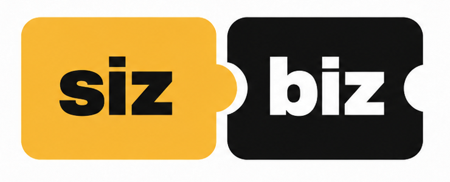
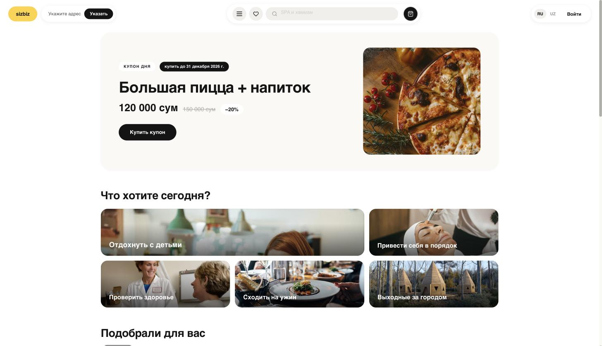
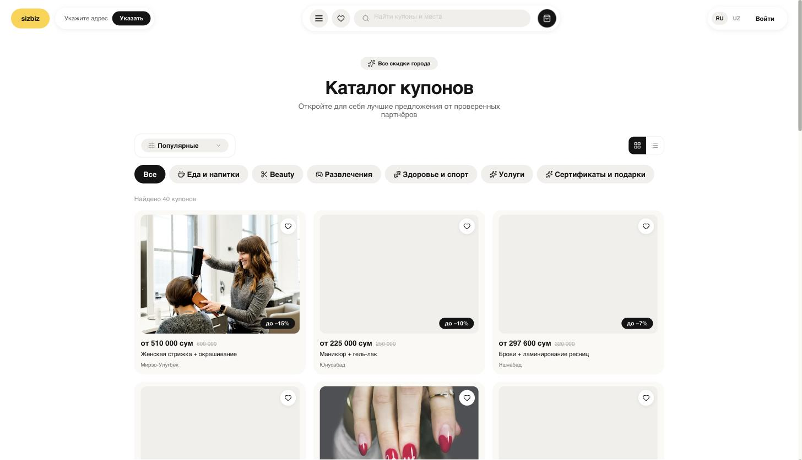
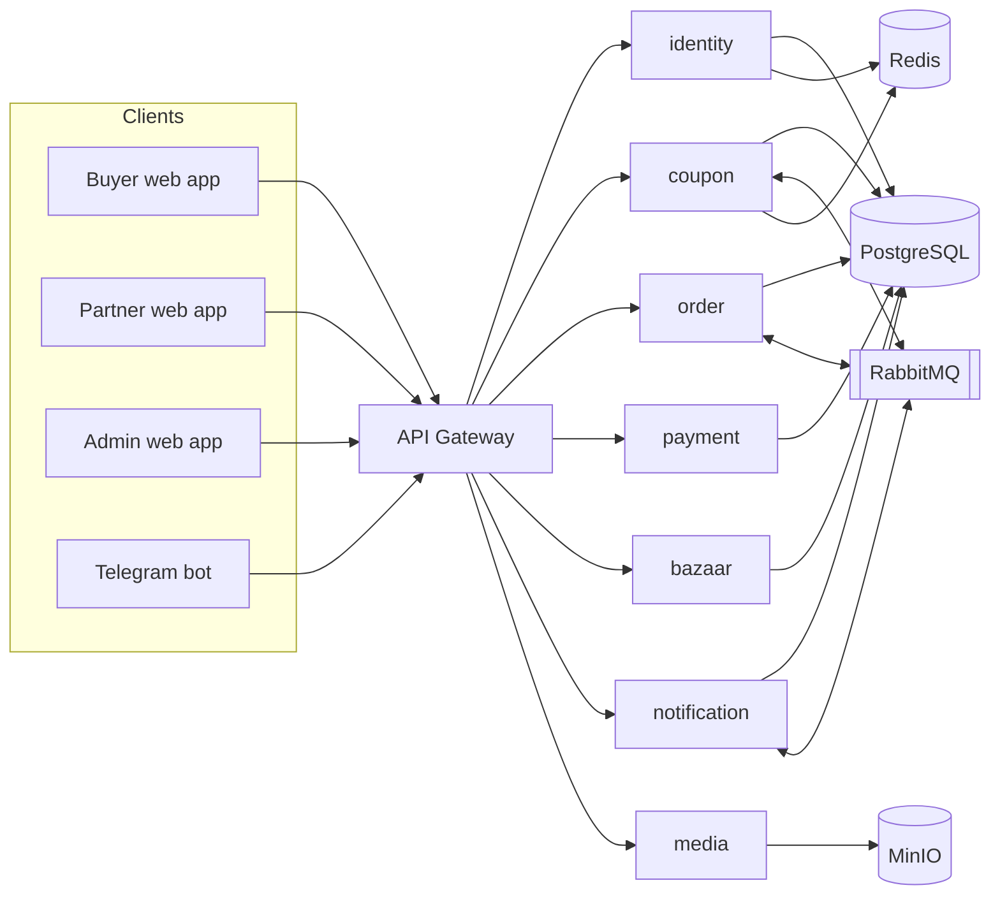

### The coupon marketplace for local business in Uzbekistan

**Buyers get transparent savings nearby. Merchants pay only for a coupon that was actually redeemed at their counter.**

**[🌐 sizbiz.uz](https://sizbiz.uz)**  ·  **[📊 Pitch deck](docs/sizbiz-pitch-deck.pdf)**  ·  **[📄 License](LICENSE)**

 

Buyer web app — storefront: coupon of the day &amp; curated situations

Catalog — real offers across 6 categories, with filters &amp; sorting

---

## Overview

Promotions happen every day in Uzbekistan — scattered across Instagram, Telegram chats and offline banners. Nobody can find them in one place, verify their real terms, or prove a purchase at the counter. And nobody can measure them.

**sizbiz** turns that noise into **one controlled loop — from offer to a redeemed customer.** A merchant publishes a coupon after moderation; a buyer sees the real price and buys it; staff redeem it by QR or PIN, once, at that location; every sale, redemption, refund and review is recorded.

> **1.21 million small businesses generate 51.5% of Uzbekistan's GDP** — most have no marketing staff and no affordable way to buy measurable demand. sizbiz gives them **pay-per-result** marketing.

---

## The problem

| For buyers | For small businesses |
|---|---|
| Offers are scattered across Instagram, Telegram and banners. No single place to find an offer, verify its terms, buy it and prove the purchase. Conditions stay unclear until payment. | The standard alternative is an SMM / ads agency: **$700–2,500 / month + $500–2,000 media budget, paid upfront** — whether or not a single customer walks in. The business pays for impressions, not customers. |

## The solution — one controlled loop

| 1. Apply | 2. Moderate | 3. Buy | 4. Redeem | 5. Measure |
|---|---|---|---|---|
| Merchant applies via web or Telegram bot. No app, no paperwork. | Our team verifies price, terms and limits. Merchant approves before publication. | Buyer sees real price, discount and expiry — then buys and stores the coupon. | Staff scan QR or PIN. Locked to that merchant, that location, exactly once. | Sales, redemptions, reviews, refunds and complaints — all recorded. |

**Access channels:** three web applications — **buyer, partner, admin** — plus a **Telegram bot**, in a country where Telegram reaches ~25 million monthly users.

---

## Why it works

- **Full closed loop.** Publication → purchase → QR/PIN redemption → statistics → reviews & refunds. Social networks and classifieds stop at publication.
- **Trust layer by design.** Every offer passes moderation and explicit merchant approval. Complaints, refunds and audit are built into the product, not bolted on.
- **Telegram-native.** Login, notifications and a concierge bot in the channel where the whole country already lives.
- **Anti-fraud by design.** Idempotent sale and redemption ledgers, exactly one payment guaranteed per order, location-bound redemption rights for cashiers.

## Business model

The merchant pays a commission **only when a coupon is actually redeemed** at their location. No listing fees. No retainer. No upfront media budget.

| | Ads / SMM agency | **sizbiz** |
|---|---|---|
| Upfront cost | $700–2,500/mo + media | **Zero** — free listing after moderation |
| Pays for | Impressions and clicks | **A real customer at the counter** |
| Risk | Fully on the merchant | **Shared — we earn only on results** |
| Measurability | Indirect: reach, CTR | **Exact: sales, redemptions, repeat buyers** |

---

## Architecture

Spring Cloud microservices behind a single API gateway; service-per-database; async events over RabbitMQ.

Discovery via **Eureka**, centralised configuration via a **config server**, observability via **Prometheus / Grafana / Loki**.

## Tech stack

**Backend** — Java 21 · Spring Boot 3.4 · Spring Cloud Gateway · Eureka · Spring Security / JWT · PostgreSQL 16 · RabbitMQ · Redis · MinIO
**Frontend** — React 19 · Vite · TypeScript
**Delivery** — Docker · Docker Swarm · GitHub Actions CI/CD · Prometheus · Grafana · Loki

## Status

| 8 | 173 | 3 + bot | 40 · 6 |
|:--:|:--:|:--:|:--:|
| deployed microservices | REST API endpoints | web platforms live | offers · categories |

**Honest status:** onboarding, moderation, catalog, cart, orders, QR/PIN redemption, refunds, complaints and statistics are implemented and working in production. **Online payments currently run in demo mode** — integration with a local provider (**Payme / Click / Uzum**) is the next milestone.

## Roadmap

| Stage | Period | Targets |
|---|---|---|
| **Pilot — Tashkent** | Months 1–6 | Payment provider integration · 100–150 active partners · 10,000+ buyers · redemption rate >60% |
| **City scale-up** | Months 6–18 | 500+ partners · 100,000+ buyers · promoted placement revenue · repeat purchases >30% |
| **National** | Months 18–36 | Samarkand, Bukhara, Namangan, Andijan · 3,000+ partners · partner self-service analytics |

*Figures are management targets, not audited forecasts.*

## Team

Built in-house — the founding team owns every layer of the product.

- **Abror Khaitboboev** — Founder · Software Engineer. Backend and platform architecture, the entire microservice system, deployment and CI/CD.
- **Kamola Esanova** — Product Manager. Product flows, merchant onboarding and moderation, partner research and offer quality.

---

## Documentation

- [Russian documentation](docs/ru/README.md) · [English documentation](docs/en/README.md)
- [Business documentation (sales & staff)](docs/ru/business/README.md)
- [Pitch deck (PDF)](docs/sizbiz-pitch-deck.pdf)

## License

**Proprietary — All rights reserved.** This is closed commercial software. Access may be granted **solely for evaluation and review** (including technology-award juries); it grants no right to use, copy, modify or distribute the code. See [`LICENSE`](LICENSE).

sizbiz.uz — Benefit to people. Growth to business. Value nearby.

