# Database Architecture — TopDim

> Полная документация по базам данных. Оптимизировано для 5M+ пользователей.

## Обзор

| Параметр | Значение |
|---|---|
| СУБД | PostgreSQL 16 |
| Кэш | Redis 7 |
| Поиск | Elasticsearch 8.12 (CQRS) |
| Миграции | Flyway |
| Пул соединений | HikariCP (30 max) |

## Базы данных

```
PostgreSQL Instance
├── topdim_auth     ← auth-service
├── topdim_coupon   ← coupon-service
├── topdim_order    ← order-service
├── topdim_payment  ← payment-service
├── topdim_bazaar   ← bazaar-service
└── topdim_user     ← user-service (+ favorites)
```

---

## ERD Диаграмма

```mermaid
erDiagram
    %% Auth Service
    users {
        bigint id PK
        varchar email UK
        varchar phone UK
        varchar password
        varchar first_name
        varchar last_name
        varchar role
        varchar avatar_url
        boolean enabled
        boolean email_verified
        boolean phone_verified
        timestamp created_at
        timestamp updated_at
        boolean deleted
    }
    refresh_tokens {
        bigint id PK
        varchar token UK
        bigint user_id FK
        timestamp expires_at
        boolean revoked
        timestamp created_at
    }
    users ||--o{ refresh_tokens : "has"

    %% Coupon Service
    categories {
        bigint id PK
        varchar name
        varchar name_uz
        varchar slug UK
        varchar icon_url
        int sort_order
        boolean active
    }
    merchants {
        bigint id PK
        varchar name
        text description
        varchar logo_url
        varchar address
        varchar phone
        varchar website
        boolean deleted
    }
    coupon_offers {
        bigint id PK
        varchar title
        text short_description
        text full_description
        bigint merchant_id FK
        bigint category_id FK
        decimal old_price
        decimal from_price
        int discount_percent
        varchar status
        varchar cover_image_url
        timestamp buy_until
        timestamp use_until
        int total_sold
        tsvector search_vector
        boolean deleted
    }
    coupon_options {
        bigint id PK
        bigint coupon_offer_id FK
        varchar name
        decimal original_price
        decimal coupon_price
        int quantity_limit
        int quantity_sold
        varchar status
    }
    coupon_images {
        bigint id PK
        bigint coupon_offer_id FK
        varchar url
        int sort_order
    }
    categories ||--o{ coupon_offers : "contains"
    merchants ||--o{ coupon_offers : "sells"
    coupon_offers ||--o{ coupon_options : "has"
    coupon_offers ||--o{ coupon_images : "has"

    %% Order Service
    carts {
        bigint id PK
        bigint user_id UK
        timestamp created_at
    }
    cart_items {
        bigint id PK
        bigint cart_id FK
        bigint coupon_offer_id
        bigint coupon_option_id
        decimal unit_price
        int quantity
        boolean is_gift
    }
    orders {
        bigint id PK
        varchar order_number UK
        bigint user_id
        decimal total_amount
        varchar status
        timestamp created_at
        timestamp paid_at
        boolean deleted
    }
    order_items {
        bigint id PK
        bigint order_id FK
        bigint coupon_offer_id
        bigint coupon_option_id
        decimal unit_price
        int quantity
    }
    purchased_coupons {
        bigint id PK
        bigint user_id
        bigint order_id FK
        varchar coupon_code UK
        varchar qr_token UK
        varchar status
        timestamp purchased_at
        timestamp expires_at
        timestamp used_at
        boolean deleted
    }
    redemptions {
        bigint id PK
        bigint purchased_coupon_id FK
        varchar redemption_code UK
        bigint merchant_id
        varchar redeemed_by_staff
        timestamp redeemed_at
    }
    refund_requests {
        bigint id PK
        bigint order_id FK
        bigint user_id
        varchar reason
        varchar status
        varchar admin_comment
        timestamp created_at
        timestamp resolved_at
    }
    carts ||--o{ cart_items : "contains"
    orders ||--o{ order_items : "contains"
    orders ||--o{ purchased_coupons : "generates"
    orders ||--o{ refund_requests : "has"
    purchased_coupons ||--o| redemptions : "redeemed"

    %% Payment Service
    payments {
        bigint id PK
        bigint order_id
        bigint user_id
        decimal amount
        varchar currency
        varchar provider
        varchar status
        varchar transaction_id UK
        text payment_url
        timestamp created_at
        timestamp completed_at
        boolean deleted
    }

    %% Bazaar Service
    shop_categories {
        bigint id PK
        varchar name UK
        varchar name_uz
        varchar slug
        boolean active
    }
    bazaars {
        bigint id PK
        varchar name
        varchar name_uz
        varchar type
        varchar address
        varchar city
        double latitude
        double longitude
        text description
        tsvector search_vector
        boolean deleted
    }
    bazaar_maps {
        bigint id PK
        bigint bazaar_id FK
        int floor_number
        varchar map_image_url
        varchar map_svg_url
    }
    shops {
        bigint id PK
        bigint bazaar_id FK
        varchar name
        bigint category_id FK
        boolean has_coupon
        bigint linked_coupon_offer_id
        tsvector search_vector
        boolean deleted
    }
    shop_product_tags {
        bigint id PK
        bigint shop_id FK
        varchar tag
        varchar tag_uz
    }
    bazaars ||--o{ bazaar_maps : "has"
    bazaars ||--o{ shops : "contains"
    shop_categories ||--o{ shops : "categorizes"
    shops ||--o{ shop_product_tags : "tagged"

    %% User Service
    favorites {
        bigint id PK
        bigint user_id FK
        bigint coupon_offer_id
        timestamp created_at
    }
```



---

## Таблицы по сервисам

### Auth Service (topdim_auth) — 2 таблицы

| Таблица | Строк (5M юзеров) | Описание |
|---|---|---|
| `users` | 5 000 000 | Пользователи |
| `refresh_tokens` | ~10 000 000 | Refresh токены (2 на юзера) |

### Coupon Service (topdim_coupon) — 5 таблиц

| Таблица | Строк | Описание |
|---|---|---|
| `categories` | ~20 | Категории купонов |
| `merchants` | ~500 | Партнёры/продавцы |
| `coupon_offers` | ~5 000 | Купонные предложения |
| `coupon_options` | ~15 000 | Варианты купонов |
| `coupon_images` | ~20 000 | Изображения купонов |

### Order Service (topdim_order) — 7 таблиц

| Таблица | Строк (год) | Описание |
|---|---|---|
| `carts` | 5 000 000 | Корзины (1 на юзера) |
| `cart_items` | ~2 000 000 | Товары в корзинах |
| `orders` | **12 000 000** | Заказы (партиционирована) |
| `order_items` | ~20 000 000 | Позиции заказов |
| `purchased_coupons` | **24 000 000** | Купленные купоны |
| `redemptions` | ~15 000 000 | Записи погашения |
| `refund_requests` | ~500 000 | Запросы на возврат |

### Payment Service (topdim_payment) — 1 таблица

| Таблица | Строк | Описание |
|---|---|---|
| `payments` | **12 000 000** | Платежи |

### Bazaar Service (topdim_bazaar) — 5 таблиц

| Таблица | Строк | Описание |
|---|---|---|
| `shop_categories` | ~20 | Категории магазинов |
| `bazaars` | ~200 | Базары |
| `bazaar_maps` | ~500 | Карты базаров |
| `shops` | ~50 000 | Магазины |
| `shop_product_tags` | ~200 000 | Теги продуктов |

### User Service (topdim_user) — 1 таблица

| Таблица | Строк | Описание |
|---|---|---|
| `favorites` | ~10 000 000 | Избранные купоны |

---

## Индексы

### Типы индексов

| Тип | Где используется | Зачем |
|---|---|---|
| B-tree (обычный) | PK, FK, status | Точный поиск, JOIN |
| B-tree (составной) | `(user_id, status)` | Два поля одновременно |
| B-tree (partial) | `WHERE deleted = FALSE` | Исключить удалённые |
| GIN | `search_vector` | Полнотекстовый поиск |

### Полный список составных индексов

```sql
-- Auth
idx_users_email_enabled(email, enabled)
idx_refresh_tokens_user_revoked(user_id, revoked)

-- Coupon
idx_coupon_offers_category_status(category_id, status)
idx_coupon_offers_status_created(status, created_at DESC)
idx_coupon_offers_search USING GIN(search_vector)

-- Order
idx_orders_user_status(user_id, status)
idx_orders_user_created(user_id, created_at DESC)
idx_purchased_coupons_user_status(user_id, status)
idx_orders_not_deleted(user_id, status) WHERE deleted = FALSE

-- Payment
idx_payments_order_status(order_id, status)
idx_payments_user_status(user_id, status)

-- Bazaar
idx_bazaars_city_active(city, active)
idx_shops_bazaar_coupon(bazaar_id, has_coupon)
idx_shops_search USING GIN(search_vector)
```

---

## Оптимизации для 5M+ пользователей

### 1. Connection Pool (HikariCP)
```yaml
hikari:
  maximum-pool-size: 30
  minimum-idle: 10
  connection-timeout: 20000
  leak-detection-threshold: 30000
```

### 2. Soft Delete
Все основные таблицы имеют `deleted BOOLEAN DEFAULT FALSE`.
Физическое удаление запрещено — данные архивируются.

### 3. Full-Text Search (GIN)
`coupon_offers`, `shops`, `bazaars` имеют `search_vector tsvector` с авто-триггером.

### 4. Партиционирование
`orders` партиционирована по `created_at` (квартально).

### 5. Read Replicas
`ReadWriteRoutingDataSource` направляет `@Transactional(readOnly=true)` на replica.

### 6. PostgreSQL Tuning
`docker/postgresql.conf` — оптимизировано для 16GB RAM, SSD, replication.

### 7. CQRS (Elasticsearch)
Каталог купонов синхронизируется в Elasticsearch для мгновенного поиска.

---

## Sharding стратегия (10M+ пользователей)

```
Shard Key: user_id

Shard 1: user_id 1 — 2,000,000
Shard 2: user_id 2,000,001 — 4,000,000
Shard 3: user_id 4,000,001 — 6,000,000
...

Реализация: PostgreSQL Citus extension
Шардируемые таблицы: orders, purchased_coupons, payments, favorites
Не шардируемые: categories, merchants, coupon_offers (reference tables)
```

---

## Flyway миграции

| Сервис | Миграции |
|---|---|
| auth | V1 (tables), V2 (indexes), V3 (audit) |
| coupon | V1 (tables), V2 (indexes), V3 (audit), V4 (GIN search) |
| order | V1 (tables), V2 (redemptions), V3 (refunds), V4 (indexes), V5 (audit), V6 (partitioning) |
| payment | V1 (tables), V2 (indexes), V3 (audit) |
| bazaar | V1 (tables), V2 (indexes), V3 (audit), V4 (GIN search) |
| user | V1 (favorites), V2 (indexes) |

## Резервное копирование

```bash
# Ежедневный backup (pg_dump)
pg_dump -U topdim -Fc topdim_auth > backup/auth_$(date +%Y%m%d).dump
pg_dump -U topdim -Fc topdim_order > backup/order_$(date +%Y%m%d).dump

# WAL archiving для point-in-time recovery
archive_mode = on
archive_command = 'cp %p /backup/wal/%f'

# Восстановление
pg_restore -U topdim -d topdim_order backup/order_20260325.dump
```
