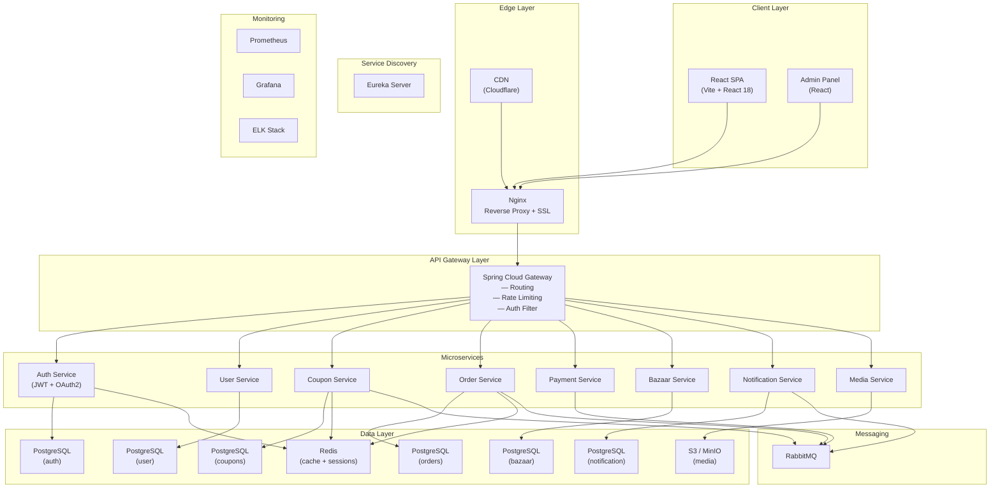
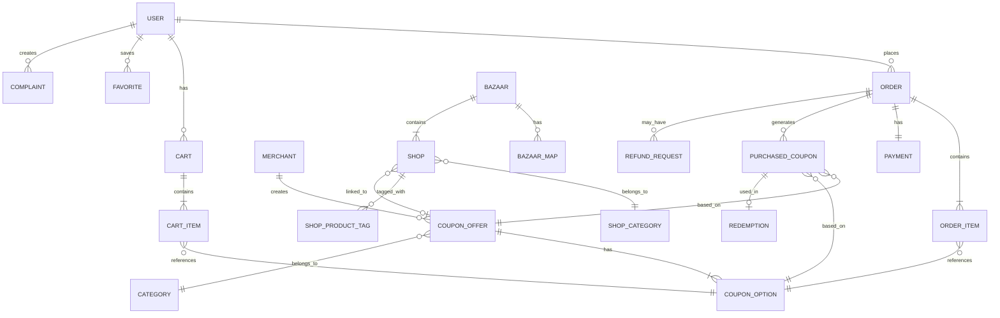
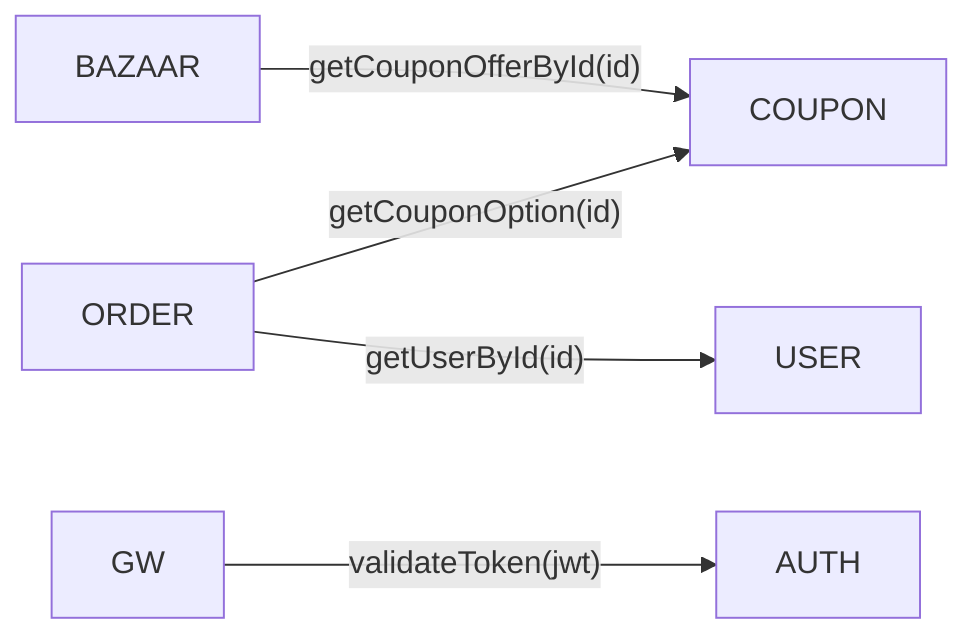
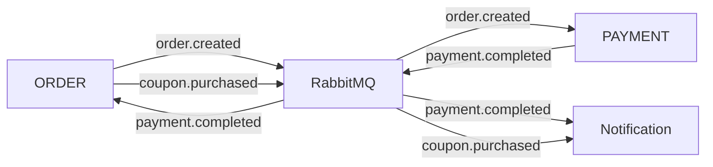
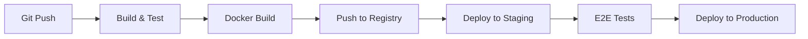

# TopDim Platform — Архитектура и План Реализации

> Coupon Marketplace + Онлайн Базар — MVP для рынка Узбекистана

## Обзор

Платформа **TopDim** — единое веб-приложение, объединяющее **купонный маркетплейс** и **онлайн-базар** (карта + каталог магазинов). Архитектура строится на микросервисах (Java/Spring Boot) с React-фронтендом, рассчитана на высокую нагрузку и масштабируемость.

---

## 1. Архитектура системы

### 1.1 High-Level Architecture



### 1.2 Принципы архитектуры

| Принцип | Решение |
|---|---|
| **Database per Service** | Каждый сервис имеет свою БД (schema isolation) |
| **API Gateway** | Spring Cloud Gateway — единая точка входа |
| **Service Discovery** | Eureka — автоматическое обнаружение сервисов |
| **Async Communication** | RabbitMQ для событий (order.created, payment.completed) |
| **Sync Communication** | REST (OpenFeign) между сервисами |
| **Auth** | JWT + Spring Security (stateless) |
| **Caching** | Redis для каталога купонов, сессий, rate limiting |
| **Media** | MinIO (S3-compatible) для изображений / карт |
| **Config** | Spring Cloud Config Server (Git-backed) |

---

## 2. Стек технологий

### 2.1 Backend

| Компонент | Технология |
|---|---|
| Язык | Java 21 (LTS) |
| Framework | Spring Boot 3.4 |
| API Gateway | Spring Cloud Gateway |
| Service Discovery | Spring Cloud Netflix Eureka |
| Config | Spring Cloud Config |
| Security | Spring Security + JWT |
| ORM | Spring Data JPA + Hibernate |
| DB | PostgreSQL 16 |
| Cache | Redis 7 |
| Messaging | RabbitMQ 3.13 |
| Object Storage | MinIO |
| Build | Gradle (multi-module) |
| API Docs | SpringDoc OpenAPI (Swagger UI) |
| Migration | Flyway |
| Mapping | MapStruct |
| Validation | Jakarta Validation |
| Testing | JUnit 5 + Testcontainers |

### 2.2 Frontend

| Компонент | Технология |
|---|---|
| Framework | React 19 |
| Build Tool | Vite 8 |
| Routing | React Router 6 (Web) / 7 (Admin) |
| State | Zustand |
| HTTP Client | Axios + React Query (TanStack Query v5) |
| UI Kit | Ant Design 6 (Admin) + Custom UI / CSS Modules (Web) |
| Map | 2GIS MapGL |
| Forms | React Hook Form + Zod |
| i18n | react-i18next (ru, uz) |
| Charts (Admin) | Recharts |
| Icons | Lucide React |

### 2.3 Infrastructure / DevOps

| Компонент | Технология |
|---|---|
| Containers | Docker + Docker Compose |
| Orchestration | Kubernetes (production) / Docker Compose (staging) |
| CI/CD | GitHub Actions |
| Reverse Proxy | Nginx |
| SSL | Let's Encrypt (Certbot) |
| CDN | Cloudflare |
| Monitoring | Prometheus + Grafana |
| Logging | ELK (Elasticsearch, Logstash, Kibana) |
| Cloud | VPS (Hetzner / DigitalOcean) или local DC в Узбекистане |

---

## 3. Структура микросервисов

### 3.1 Перечень сервисов

```
topdim/
├── infrastructure/
│   ├── api-gateway/              # Spring Cloud Gateway
│   ├── discovery-server/         # Eureka Server
│   ├── config-server/            # Spring Cloud Config
│   └── docker/                   # Docker Compose файлы
│
├── services/
│   ├── auth-service/             # Регистрация, логин, JWT
│   ├── user-service/             # Профиль, избранное
│   ├── coupon-service/           # CouponOffer, CouponOption, каталог
│   ├── order-service/            # Cart, Order, Checkout
│   ├── payment-service/          # Интеграция с платёжной системой
│   ├── bazaar-service/           # Bazaar, Shop, Map
│   ├── notification-service/     # Email, SMS, push
│   └── media-service/            # Загрузка и отдача файлов
│
├── frontend/
│   ├── web-app/                  # React SPA (Vite)
│   └── admin-app/                # Admin Panel (React)
│
├── shared/
│   ├── common-dto/               # Общие DTO
│   └── common-events/            # Общие классы событий
│
├── docs/                         # Документация
├── docker-compose.yml
├── docker-compose.prod.yml
└── build.gradle (root)
```

### 3.2 Описание каждого сервиса

---

#### Auth Service (`auth-service`)
**Port:** 8081 | **DB:** `topdim_auth`

| Endpoint | Method | Описание |
|---|---|---|
| `/api/v1/auth/register` | POST | Регистрация (email/phone + пароль) |
| `/api/v1/auth/login` | POST | Вход, возврат JWT |
| `/api/v1/auth/refresh` | POST | Обновление токена |
| `/api/v1/auth/logout` | POST | Инвалидация токена |
| `/api/v1/auth/verify` | GET | Подтверждение email/phone |

**Entities:** `User`, `Role`, `RefreshToken`

---

#### User Service (`user-service`)
**Port:** 8082 | **DB:** `topdim_user`

| Endpoint | Method | Описание |
|---|---|---|
| `/api/v1/users/me` | GET | Текущий профиль |
| `/api/v1/users/me` | PUT | Обновление профиля |
| `/api/v1/users/me/favorites` | GET | Избранное |
| `/api/v1/users/me/favorites` | POST/DELETE | Управление избранным |
| `/api/v1/partner/staff` | POST/GET | Управление сотрудниками (кассирами) |
| `/api/v1/admin/users` | GET | Управление пользователями |

---

#### Coupon Service (`coupon-service`)
**Port:** 8083 | **DB:** `topdim_coupon`

| Endpoint | Method | Описание |
|---|---|---|
| `/api/v1/coupons` | GET | Каталог купонов (фильтры, сортировка, пагинация) |
| `/api/v1/coupons/{id}` | GET | Карточка купона |
| `/api/v1/coupons/{id}/options` | GET | Варианты купона |
| `/api/v1/categories` | GET | Категории |
| `/api/v1/merchants` | GET | Партнёры |
| `/api/v1/merchants/{id}` | GET | Карточка партнёра |
| `/api/v1/admin/coupons` | POST/PUT/DELETE | CRUD (admin) |
| `/api/v1/admin/merchants` | POST/PUT/DELETE | CRUD (admin) |

**Entities:** `CouponOffer`, `CouponOption`, `Category`, `Merchant`, `CouponImage`

**Events published:** `CouponStatusChanged`

---

#### Order Service (`order-service`)
**Port:** 8084 | **DB:** `topdim_order`

| Endpoint | Method | Описание |
|---|---|---|
| `/api/v1/cart` | GET | Текущая корзина |
| `/api/v1/cart/items` | POST | Добавить в корзину |
| `/api/v1/cart/items/{id}` | PUT/DELETE | Изменить / удалить |
| `/api/v1/orders` | POST | Создать заказ (checkout) |
| `/api/v1/orders` | GET | Список заказов |
| `/api/v1/orders/{id}` | GET | Детали заказа |
| `/api/v1/orders/{id}/coupons` | GET | Купленные купоны заказа |
| `/api/v1/admin/orders` | GET | Все заказы (admin) |

**Entities:** `Cart`, `CartItem`, `Order`, `OrderItem`, `PurchasedCoupon`, `Redemption`

**Events published:** `OrderCreated`, `OrderPaid`, `CouponRedeemed`
**Events consumed:** `PaymentCompleted`, `PaymentFailed`

---

#### Payment Service (`payment-service`)
**Port:** 8085 | **DB:** `topdim_order` (shared or separate)

| Endpoint | Method | Описание |
|---|---|---|
| `/api/v1/payments/create` | POST | Инициировать платёж |
| `/api/v1/payments/{id}/status` | GET | Статус платежа |
| `/api/v1/payments/callback` | POST | Webhook от провайдера |

**Интеграции:** Payme, Click, Uzum Bank (один из них для MVP)

**Events published:** `PaymentCompleted`, `PaymentFailed`
**Events consumed:** `OrderCreated`

---

#### Bazaar Service (`bazaar-service`)
**Port:** 8086 | **DB:** `topdim_bazaar`

| Endpoint | Method | Описание |
|---|---|---|
| `/api/v1/bazaars` | GET | Список базаров (с координатами) |
| `/api/v1/bazaars/{id}` | GET | Карточка базара |
| `/api/v1/bazaars/{id}/map` | GET | Схема / карта объекта |
| `/api/v1/bazaars/{id}/shops` | GET | Магазины базара |
| `/api/v1/shops/{id}` | GET | Карточка магазина |
| `/api/v1/shops/search` | GET | Поиск магазинов |
| `/api/v1/admin/bazaars` | POST/PUT/DELETE | CRUD (admin) |
| `/api/v1/admin/shops` | POST/PUT/DELETE | CRUD (admin) |

**Entities:** `Bazaar`, `BazaarMap`, `Shop`, `ShopCategory`, `ShopProductTag`

---

#### Notification Service (`notification-service`)
**Port:** 8087 | **DB:** `topdim_notification`

Слушает события из RabbitMQ и отправляет:
- Email (SMTP / SendGrid)
- SMS (Eskiz.uz / Play Mobile)
- In-app уведомления (в БД `notifications`)

| Endpoint | Method | Описание |
|---|---|---|
| `/api/v1/notifications` | GET | Мои уведомления |
| `/api/v1/notifications/{id}/read` | PATCH | Прочитать |

**Events consumed:** `OrderPaid`, `CouponRedeemed`, `UserRegistered`, `CouponPurchased`

---

#### Media Service (`media-service`)
**Port:** 8088 | Storage: MinIO

| Endpoint | Method | Описание |
|---|---|---|
| `/api/v1/media/upload` | POST | Загрузка файла |
| `/api/v1/media/{id}` | GET | Получение файла |
| `/api/v1/media/{id}` | DELETE | Удаление |

---

## 4. Модель данных

### 4.1 ER-диаграмма (основные сущности)



---

## 5. Межсервисное взаимодействие

### 5.1 Синхронные вызовы (REST + OpenFeign)



### 5.2 Асинхронные события (RabbitMQ)



---

## 6. Безопасность

| Аспект | Реализация |
|---|---|
| **Аутентификация** | JWT (access token: 15 мин, refresh: 7 дней) |
| **Авторизация** | Spring Security + roles (GUEST, USER, PARTNER, MODERATOR, ADMIN, SUPER_ADMIN) |
| **API Gateway Auth** | JWT filter на gateway, forwarding userId, userRole в header |
| **Rate Limiting** | Redis-based rate limiter на gateway |
| **CORS** | Настроен на gateway для фронт-домена |
| **Idempotency** | Idempotency key для платежей (защита от дублей) |
| **Input Validation** | Jakarta Validation на каждом DTO |
| **Secrets** | Environment variables / Vault |

---

## 7. Frontend — Структура React-приложения

```
frontend/web-app/
├── public/
├── src/
│   ├── api/                  # Axios instance + API modules
│   │   ├── client.ts
│   │   ├── coupons.ts
│   │   ├── orders.ts
│   │   ├── bazaars.ts
│   │   └── auth.ts
│   ├── components/           # Переиспользуемые компоненты
│   │   ├── ui/               # Button, Card, Modal, Input...
│   │   ├── layout/           # Header, Footer, TabSwitcher
│   │   ├── coupon/           # CouponCard, CouponGrid, CouponFilters
│   │   ├── bazaar/           # BazaarMap, ShopCard, InteriorMap
│   │   └── cart/             # CartDrawer, CartItem
│   ├── pages/                # Route pages
│   │   ├── HomePage.tsx
│   │   ├── CouponCatalogPage.tsx
│   │   ├── CouponDetailPage.tsx
│   │   ├── CartPage.tsx
│   │   ├── CheckoutPage.tsx
│   │   ├── ProfilePage.tsx
│   │   ├── BazaarMapPage.tsx
│   │   ├── BazaarDetailPage.tsx
│   │   ├── ShopDetailPage.tsx
│   │   └── SearchPage.tsx
│   ├── hooks/                # Custom hooks
│   ├── store/                # Zustand stores
│   ├── utils/                # Helpers
│   ├── i18n/                 # Языковые файлы
│   ├── styles/               # Global CSS + design tokens
│   ├── App.tsx
│   └── main.tsx
├── index.html
├── vite.config.ts
├── tsconfig.json
└── package.json
```

---

## 8. Дизайн-решения для MVP

| Экран | Ключевые элементы |
|---|---|
| **Главная** | Hero-баннер, Tab-switcher (Купоны / Базар), категории, карусели |
| **Каталог купонов** | Grid карточек, фильтры, сортировка, infinite scroll |
| **Карточка купона** | Галерея, цена, скидка, варианты, условия, CTA кнопки |
| **Корзина** | Drawer / Sheet, список товаров, итог |
| **Checkout** | Summary + выбор оплаты + подтверждение |
| **Профиль** | Купленные купоны (tabs: active / used / expired) |
| **Карта базаров** | Leaflet карта с маркерами, фильтры по типу |
| **Внутренняя карта** | SVG/Canvas схема с кликабельными зонами/магазинами |
| **Карточка магазина** | Название, категория, теги, фото, ссылка на купон |

---

## 9. План работы (фазы + оценки)

### Фаза 1: Инфраструктура (1-2 недели)
1. Инициализация Gradle multi-module проекта
2. Docker Compose (PostgreSQL, Redis, RabbitMQ, MinIO)
3. Eureka Server
4. Config Server
5. API Gateway + JWT фильтр
6. Общие модули (`common-dto`, `common-events`)

### Фаза 2: Auth + User (1 неделя)
1. Auth Service (register, login, JWT)
2. User Service (profile, favorites)
3. Интеграция с Gateway

### Фаза 3: Coupon + Catalog (1-2 недели)
1. Coupon Service (CRUD, каталог, поиск, фильтры)
2. Merchant CRUD
3. Категории
4. Redis-кэш для каталога
5. Admin API для купонов

### Фаза 4: Order + Payment (1-2 недели)
1. Cart (add, update, remove)
2. Order (checkout flow)
3. PurchasedCoupon generation
4. Payment Service integration (Payme / Click)
5. Async events (RabbitMQ)

### Фаза 5: Bazaar (1 неделя)
1. Bazaar CRUD
2. Shop CRUD с привязкой к карте
3. Поиск по магазинам/категориям/товарам
4. Связь Shop ↔ CouponOffer

### Фаза 6: Notification + Media (0.5-1 неделя)
1. Notification Service (email/SMS при покупке)
2. Media Service (upload/download)

### Фаза 7: Frontend Web App (2-3 недели)
1. Дизайн-система + UI Kit
2. Главная страница + TabSwitcher
3. Каталог купонов + карточка + фильтры
4. Корзина + Checkout
5. Профиль + мои купоны
6. Карта базаров (Leaflet)
7. Внутренняя карта базара (SVG)
8. Поиск

### Фаза 8: Admin Panel (1-2 недели)
1. Авторизация admin
2. CRUD купонов, партнёров
3. Управление заказами
4. CRUD базаров, магазинов
5. Базовая аналитика (таблицы + графики)

### Фаза 9: Тестирование + QA (1 неделя)
1. Unit тесты (JUnit + Mockito)
2. Integration тесты (Testcontainers)
3. E2E (browser tests)
4. Нагрузочное тестирование (k6)

### Фаза 10: Деплой (1 неделя)
1. Dockerfile для каждого сервиса
2. Docker Compose production
3. GitHub Actions CI/CD
4. Настройка VPS + домен + SSL
5. Мониторинг (Prometheus + Grafana)
6. Logging (ELK)

> **Общая оценка MVP: 10-15 недель** (при 1-2 разработчиках)

---

## 10. Стратегия деплоя

### 10.1 Среды

| Среда | Описание | Инфраструктура |
|---|---|---|
| **Local** | Разработка | Docker Compose |
| **Staging** | Тестирование | Docker Compose на VPS |
| **Production** | Продакшн | K8s / Docker Compose + Nginx |

### 10.2 CI/CD Pipeline (GitHub Actions)



1. **На каждый push в `develop`:** build → test → docker build → push → deploy staging
2. **На merge в `main`:** deploy staging → e2e tests → manual approve → deploy production

### 10.3 Docker Compose (Production)

Каждый сервис — отдельный контейнер:

```yaml
# Примерная структура
services:
  api-gateway:     { image: topdim/gateway, ports: ["8080:8080"] }
  auth-service:    { image: topdim/auth }
  coupon-service:  { image: topdim/coupon }
  order-service:   { image: topdim/order }
  payment-service: { image: topdim/payment }
  bazaar-service:  { image: topdim/bazaar }
  notification:    { image: topdim/notification }
  media-service:   { image: topdim/media }
  postgres:        { image: postgres:16 }
  redis:           { image: redis:7-alpine }
  rabbitmq:        { image: rabbitmq:3.13-management }
  minio:           { image: minio/minio }
  nginx:           { image: nginx, ports: ["80:80", "443:443"] }
```

### 10.4 Рекомендации для Узбекистана

- **Хостинг:** VPS в Hetzner (Финляндия, низкая задержка до UZ) или local DC (Uztelecom, Sarkor) для минимальной латентности
- **CDN:** Cloudflare (бесплатный план для старта)
- **DNS:** Cloudflare DNS
- **Платёжные системы:** Payme, Click, или Uzum — для MVP интегрируем одну
- **SMS:** Eskiz.uz или Play Mobile API

---

## 11. Порядок реализации в этом проекте

Я буду двигаться по следующему плану:

1. **Создать корневой Gradle проект** со всеми модулями
2. **Инфраструктурные сервисы** — Discovery, Config, Gateway
3. **Auth Service** — регистрация, логин, JWT
4. **Coupon Service** — CRUD купонов, каталог, API
5. **Order Service** — корзина, заказы, checkout
6. **Payment Service** — базовая интеграция
7. **Bazaar Service** — карта базаров, магазины
8. **Notification + Media** — уведомления, файлы
9. **React Frontend** — web-app (mobile-first)
10. **Admin Panel** — React admin
11. **Docker + CI/CD** — контейнеризация, пайплайны
12. **Тесты** — unit, integration, e2e

---

## User Review Required

> [!IMPORTANT]
> **Платёжный провайдер:** Для MVP нужен **один** провайдер. Какой предпочитаете — **Payme**, **Click**, или **Uzum**?

> [!IMPORTANT]
> **Хостинг:** Есть ли предпочтения по хостингу — зарубежный VPS (Hetzner/DO) или local DC в Узбекистане?

> [!IMPORTANT]
> **Масштаб команды:** Сколько разработчиков будет работать? Это влияет на то, стоит ли делать полный Kubernetes или обойтись Docker Compose для production.

> [!WARNING]
> Проект объёмный (10-15 недель при 1-2 разработчиках). Мы будем создавать всю структуру и код поэтапно. Я начну с инфраструктуры и backend-сервисов, затем перейду к фронтенду.

---

## Verification Plan

### Automated Tests
- **Unit тесты (JUnit 5):** `./gradlew test` — для каждого сервиса
- **Integration тесты (Testcontainers):** `./gradlew integrationTest` — тесты с реальной БД
- **Frontend тесты:** `npm test` — React component tests (Vitest)
- **E2E:** Browser-based tests через Playwright

### Manual Verification
- Проверка API через Swagger UI (`http://localhost:{port}/swagger-ui.html`)
- Ручной прогон основного flow: регистрация → каталог → корзина → оплата → купон в профиле
- Проверка карты базаров, поиск магазинов
- Проверка admin panel CRUD операций
