# Database Architecture — sizbiz

> Полная документация по базам данных. Оптимизировано для 5M+ пользователей.

## Обзор

| Параметр | Значение |
|---|---|
| СУБД | PostgreSQL 16 |
| Кэш | Redis 7 |
| Поиск | PostgreSQL indexes сейчас; Elasticsearch/CQRS описан как будущий контур и не поднят в текущем compose |
| Миграции | Flyway |
| Пул соединений | HikariCP (30 max) |

## Базы данных

```
PostgreSQL Instance
├── topdim_identity     ← identity-service (auth + user профили)
├── topdim_coupon       ← coupon-service
├── topdim_order        ← order-service
├── topdim_payment      ← payment-service
├── topdim_bazaar       ← bazaar-service
└── topdim_notification ← notification-service
```


---

## ERD Диаграмма

```mermaid
erDiagram
    %% Identity Service (topdim_identity)
    users {
        bigint id PK
        varchar email UK
        varchar phone UK
        varchar password
        varchar first_name
        varchar last_name
        varchar role "USER|PARTNER|MODERATOR|ADMIN|SUPER_ADMIN"
        long security_version "JWT invalidation counter"
        boolean email_verified
        boolean phone_verified
        boolean enabled
        varchar avatar_url
        boolean deleted
        timestamp deleted_at
        timestamp created_at
        timestamp updated_at
    }
    partner_applications {
        bigint id PK
        varchar first_name
        varchar last_name
        varchar phone
        varchar company_name
        text comment
        varchar status "PENDING|APPROVED|REJECTED"
        varchar login_email
        varchar city
        varchar business_address
        timestamp created_at
        timestamp updated_at
    }
    staff {
        bigint id PK
        bigint user_id "ID партнёра-владельца"
        bigint login_user_id "identity user кассира"
        bigint merchant_id
        bigint merchant_location_id
        varchar name
        varchar phone
        varchar role "default: CASHIER"
        boolean active
        timestamp created_at
    }
    favorites {
        bigint id PK
        bigint user_id
        bigint coupon_offer_id
        timestamp created_at
    }
    refresh_tokens {
        bigint id PK
        varchar token UK
        bigint user_id FK
        timestamp expires_at
        boolean revoked
        timestamp created_at
    }
    audit_logs {
        bigint id PK
        bigint user_id
        varchar action
        varchar entity_type
        bigint entity_id
        text details
        varchar ip_address
        timestamp created_at
    }
    auth_action_tokens {
        bigint id PK
        bigint user_id
        varchar type "PASSWORD_RESET|EMAIL_CONFIRM"
        varchar token_hash "SHA-256"
        varchar target "email or phone"
        timestamp expires_at
        timestamp used_at
        boolean revoked
        timestamp created_at
        timestamp last_sent_at
    }
    users ||--o{ refresh_tokens : "has"
    users ||--o{ favorites : "saves"
    users ||--o{ auth_action_tokens : "has"

    %% Coupon Service (topdim_coupon)
    categories {
        bigint id PK
        varchar name UK
        varchar name_uz
        varchar slug
        varchar icon_url
        int sort_order
        boolean active
    }
    merchants {
        bigint id PK
        varchar name
        varchar description
        varchar logo_url
        varchar cover_url
        varchar address "LEGACY — use merchant_locations"
        varchar phone "LEGACY — use merchant_locations"
        varchar email
        varchar website
        varchar working_hours "LEGACY — use merchant_locations"
        varchar contact_person
        boolean active
        bigint user_id "Link to identity-service"
        varchar telegram_chat_id
        timestamp created_at
        timestamp updated_at
    }
    merchant_locations {
        bigint id PK
        bigint merchant_id FK
        varchar title
        varchar address
        varchar phone
        varchar working_hours
        double latitude
        double longitude
        boolean is_primary "partial unique per merchant"
        boolean active
        timestamp created_at
        timestamp updated_at
    }
    coupon_offers {
        bigint id PK
        varchar title
        text offer_description "CANONICAL — Release 1"
        varchar short_description "LEGACY"
        text full_description "LEGACY"
        bigint merchant_id FK
        bigint category_id FK
        decimal old_price "12,2"
        decimal from_price "12,2"
        int discount_percent
        varchar cover_image_url
        timestamp buy_until
        timestamp use_until
        text terms "LEGACY"
        text usage_rules "LEGACY"
        text how_to_use "LEGACY"
        varchar address "LEGACY — use merchant_locations"
        varchar contact_phone "LEGACY — use merchant_locations"
        varchar working_hours "LEGACY — use merchant_locations"
        boolean is_gift_available
        bigint assigned_moderator_id
        varchar assigned_moderator_name
        text revision_comment
        varchar status "LEAD|DRAFT|WAITING_FOR_MERCHANT|REVISION_REQUESTED|ACTIVE|PAUSED|SOLD_OUT|ARCHIVED"
        int total_sold
        int redeemed_count
        int view_count
        decimal total_turnover "12,2"
        timestamp created_at
        timestamp updated_at
    }
    coupon_options {
        bigint id PK
        bigint coupon_offer_id FK
        varchar title
        decimal regular_price "12,2"
        decimal coupon_price "12,2"
        int quantity_limit
        int quantity_sold
        varchar status "ACTIVE|SOLD_OUT|DISABLED"
    }
    coupon_images {
        bigint id PK
        bigint coupon_offer_id FK
        varchar image_url
        int sort_order
    }
    promo_codes {
        bigint id PK
        varchar code UK
        decimal discount_amount
        boolean is_percentage
        int usage_limit
        int used_count
        timestamp expires_at
        boolean is_active
        timestamp created_at
    }
    reviews {
        bigint id PK
        bigint coupon_offer_id FK
        bigint user_id
        varchar user_name
        int rating "1-5"
        text comment
        varchar status "PENDING|APPROVED|REJECTED"
        varchar reject_reason
        timestamp created_at
    }
    bazaars_coupon {
        bigint id PK
        varchar name
        varchar name_uz
        varchar type "BAZAAR|SHOPPING_CENTER|MARKET|TRADE_COMPLEX"
        varchar description
        varchar address
        varchar city
        double latitude
        double longitude
        varchar cover_image_url
        varchar working_hours
        varchar phone
        varchar status "ACTIVE|INACTIVE"
        timestamp created_at
        timestamp updated_at
    }
    shops_coupon {
        bigint id PK
        bigint merchant_id FK "nullable"
        bigint bazaar_id FK "nullable"
        varchar name
        varchar description
        varchar category
        varchar subcategory
        varchar goods_description
        varchar phone
        varchar working_hours
        text photos "JSON array"
        varchar location_type "BAZAAR|STANDALONE"
        varchar address
        double latitude
        double longitude
        varchar pavilion
        varchar sector
        varchar row_number
        varchar shop_number
        int floor_number
        varchar status "ACTIVE|PENDING_REVIEW|INACTIVE"
        timestamp created_at
        timestamp updated_at
    }
    categories ||--o{ coupon_offers : "contains"
    merchants ||--o{ coupon_offers : "sells"
    merchants ||--o{ merchant_locations : "has"
    coupon_offers ||--o{ coupon_options : "has"
    coupon_offers ||--o{ coupon_images : "has"
    coupon_offers ||--o{ reviews : "has"
    bazaars_coupon ||--o{ shops_coupon : "contains"
    merchants ||--o{ shops_coupon : "owns"

    %% Order Service (topdim_order)
    carts {
        bigint id PK
        bigint user_id UK
        timestamp created_at
    }
    cart_items {
        bigint id PK
        bigint cart_id FK
        bigint coupon_offer_id
        bigint coupon_option_id
        decimal unit_price
        int quantity
        boolean is_gift
    }
    orders {
        bigint id PK
        varchar order_number UK
        bigint user_id
        varchar user_email
        varchar user_phone
        decimal total_amount "12,2"
        varchar status "PENDING|PAID|COMPLETED|CANCELLED|REFUNDED"
        timestamp created_at
        timestamp paid_at
    }
    order_items {
        bigint id PK
        bigint order_id FK
        bigint coupon_offer_id
        bigint coupon_option_id
        decimal unit_price
        int quantity
    }
    purchased_coupons {
        bigint id PK
        bigint user_id
        bigint order_id FK
        varchar coupon_code UK
        varchar qr_token UK
        varchar status "ACTIVE|USED|EXPIRED|REFUND_PENDING|REFUNDED|CANCELLED"
        bigint merchant_id
        varchar merchant_name
        varchar merchant_address
        varchar merchant_phone
        varchar merchant_working_hours
        boolean is_gift
        timestamp purchased_at
        timestamp expires_at
        timestamp used_at
    }
    redemptions {
        bigint id PK
        bigint purchased_coupon_id FK
        varchar redemption_code UK
        bigint merchant_id
        bigint merchant_location_id
        bigint staff_id
        varchar redeem_method "PIN|QR|LEGACY"
        varchar redeemed_by_staff
        timestamp redeemed_at
    }
    refund_requests {
        bigint id PK
        bigint order_id FK
        bigint purchased_coupon_id FK
        bigint user_id
        varchar reason
        varchar status "PENDING|APPROVED_PROCESSING|REFUNDED|REJECTED"
        varchar admin_comment
        decimal refund_amount "12,2"
        timestamp expected_refund_at
        timestamp completed_at
        timestamp created_at
        timestamp resolved_at
    }
    complaints {
        bigint id PK
        bigint order_id FK
        bigint user_id
        bigint purchased_coupon_id FK
        varchar subject
        text description
        varchar status
        text resolution
        timestamp created_at
        timestamp resolved_at
    }
    carts ||--o{ cart_items : "contains"
    orders ||--o{ order_items : "contains"
    orders ||--o{ purchased_coupons : "generates"
    orders ||--o{ refund_requests : "has"
    orders ||--o{ complaints : "has"
    purchased_coupons ||--o| redemptions : "redeemed"

    %% Payment Service (topdim_payment)
    payments {
        bigint id PK
        bigint order_id
        bigint user_id
        decimal amount "12,2"
        varchar currency "default: UZS"
        varchar provider "PAYME|CLICK|UZUM"
        varchar status "PENDING|COMPLETED|FAILED|REFUNDED"
        varchar transaction_id UK
        varchar payment_url
        varchar error_message
        timestamp created_at
        timestamp completed_at
    }

    %% Bazaar Service (topdim_bazaar)
    shop_categories {
        bigint id PK
        varchar name UK
        varchar name_uz
        varchar slug
        boolean active
    }
    bazaars {
        bigint id PK
        varchar name
        varchar name_uz
        varchar type "CENTRAL|DISTRICT|WHOLESALE|TRADE_COMPLEX"
        varchar address
        varchar city
        double latitude
        double longitude
        text description
        tsvector search_vector
    }
    bazaar_maps {
        bigint id PK
        bigint bazaar_id FK
        int floor_number
        varchar map_image_url
        varchar map_svg_url
    }
    shops {
        bigint id PK
        bigint bazaar_id FK
        varchar name
        bigint category_id FK
        boolean has_coupon
        bigint linked_coupon_offer_id
        tsvector search_vector
    }
    shop_product_tags {
        bigint id PK
        bigint shop_id FK
        varchar tag
        varchar tag_uz
    }
    bazaars ||--o{ bazaar_maps : "has"
    bazaars ||--o{ shops : "contains"
    shop_categories ||--o{ shops : "categorizes"
    shops ||--o{ shop_product_tags : "tagged"

    %% Notification Service (topdim_notification)
    notifications {
        bigint id PK
        bigint user_id
        varchar type
        varchar title
        text message
        boolean is_read
        timestamp created_at
        timestamp updated_at
    }
```



---

## Таблицы по сервисам

### Identity Service (topdim_identity) — 7 таблиц

| Таблица | Строк (5M юзеров) | Описание |
|---|---|---|
| `users` | 5 000 000 | Пользователи (auth + профиль) |
| `refresh_tokens` | ~10 000 000 | Refresh токены (2 на юзера) |
| `auth_action_tokens` | ~5 000 000 | Токены сброса пароля / верификации email |
| `audit_logs` | ~50 000 000 | Логи действий администраторов |
| `partner_applications` | ~10 000 | Заявки на партнёрство |
| `staff` | ~15 000 | Сотрудники партнёров (кассиры) |
| `favorites` | ~10 000 000 | Избранные купоны пользователей |

### Coupon Service (topdim_coupon) — 10 таблиц

| Таблица | Строк | Описание |
|---|---|---|
| `categories` | ~20 | Категории купонов |
| `merchants` | ~500 | Партнёры/продавцы |
| `merchant_locations` | ~1 000 | Филиалы/адреса мерчантов (Release 1) |
| `coupon_offers` | ~5 000 | Купонные предложения (LEAD→DRAFT→WAITING_FOR_MERCHANT→REVISION_REQUESTED→ACTIVE→SOLD_OUT) |
| `coupon_options` | ~15 000 | Варианты купонов (title, regularPrice, couponPrice) |
| `coupon_images` | ~20 000 | Изображения купонов |
| `promo_codes` | ~1 000 | Промокоды (discountAmount, isPercentage) |
| `reviews` | ~500 000 | Отзывы на купоны |
| `bazaars` | ~200 | Базары (справочник, coupon-service) |
| `shops` | ~50 000 | Магазины (BAZAAR/STANDALONE, coupon-service) |

### Order Service (topdim_order) — 8 таблиц

| Таблица | Строк (год) | Описание |
|---|---|---|
| `carts` | 5 000 000 | Корзины (1 на юзера) |
| `cart_items` | ~2 000 000 | Товары в корзинах |
| `orders` | **12 000 000** | Заказы (партиционирована) |
| `order_items` | ~20 000 000 | Позиции заказов |
| `purchased_coupons` | **24 000 000** | Купленные купоны |
| `redemptions` | ~15 000 000 | Записи погашения |
| `refund_requests` | ~500 000 | Запросы на возврат |
| `complaints` | ~50 000 | Жалобы на заказы |

### Payment Service (topdim_payment) — 1 таблица

| Таблица | Строк | Описание |
|---|---|---|
| `payments` | **12 000 000** | Платежи (PAYME/CLICK/UZUM) |

### Bazaar Service (topdim_bazaar) — 5 таблиц

| Таблица | Строк | Описание |
|---|---|---|
| `shop_categories` | ~20 | Категории магазинов |
| `bazaars` | ~200 | Базары |
| `bazaar_maps` | ~500 | Карты базаров |
| `shops` | ~50 000 | Магазины |
| `shop_product_tags` | ~200 000 | Теги продуктов |

### Notification Service (topdim_notification) — 1 таблица

| Таблица | Строк | Описание |
|---|---|---|
| `notifications` | ~100 000 000 | Уведомления (сильно изменяемая) |

---

## Индексы

### Типы индексов

| Тип | Где используется | Зачем |
|---|---|---|
| B-tree (обычный) | PK, FK, status | Точный поиск, JOIN |
| B-tree (составной) | `(user_id, status)` | Два поля одновременно |
| B-tree (partial) | `WHERE deleted = FALSE` | Исключить удалённые |
| GIN | `search_vector` | Полнотекстовый поиск |

### Полный список составных индексов

```sql
-- Identity
idx_users_email_enabled(email, enabled)
idx_refresh_tokens_user_revoked(user_id, revoked)

-- Coupon
idx_coupon_offers_category_status(category_id, status)
idx_coupon_offers_status_created(status, created_at DESC)

-- Order
idx_orders_user_status(user_id, status)
idx_orders_user_created(user_id, created_at DESC)
idx_purchased_coupons_user_status(user_id, status)

-- Payment
idx_payments_order_status(order_id, status)
idx_payments_user_status(user_id, status)

-- Bazaar
idx_shops_search USING GIN(search_vector)
```

---

## Оптимизации для 5M+ пользователей

### 1. Connection Pool (HikariCP)
```yaml
hikari:
  maximum-pool-size: 30
  minimum-idle: 10
  connection-timeout: 20000
  leak-detection-threshold: 30000
```

### 2. Soft Delete
Основные таблицы поддерживают soft delete через `deleted BOOLEAN`.

### 3. Партиционирование
`orders` партиционирована по `created_at` (квартально).

### 4. Read Replicas
`ReadWriteRoutingDataSource` направляет `@Transactional(readOnly=true)` на replica.

### 5. PostgreSQL Tuning
`docker/postgresql.conf` — оптимизировано для 16GB RAM, SSD, replication.

### 6. Поиск и будущий CQRS
В текущей локальной конфигурации Elasticsearch не поднимается. Каталог и справочник работают через PostgreSQL индексы/GIN там, где они есть. Elasticsearch/CQRS оставлен как будущая production-оптимизация, а не как активная зависимость проекта.

---

## Sharding стратегия (10M+ пользователей)

```
Shard Key: user_id

Shard 1: user_id 1 — 2,000,000
Shard 2: user_id 2,000,001 — 4,000,000
Shard 3: user_id 4,000,001 — 6,000,000
...

Реализация: PostgreSQL Citus extension
Шардируемые таблицы: orders, purchased_coupons, payments, favorites
Не шардируемые: categories, merchants, coupon_offers (reference tables)
```

---

## Flyway миграции

| Сервис | Миграции |
|---|---|
| identity | V1 (users), V2 (refresh_tokens), V3 (audit_logs), V4 (favorites), V5 (staff), V6 (partner_applications), V7 (indexes), V8 (security_version), V9 (auth_action_tokens), V10 (partner onboarding fields), V11 (staff cabinet fields) |
| coupon | V1-V12 (base tables, indexes, reviews/promos, search, soft delete, draft/status/statistics), V13-V18 (merchant locations, offer_description, phone normalization, archive fields), V19-V20 (sales/redemption ledgers) |
| order | V1 (tables), V2 (redemptions), V3 (refunds), V4 (indexes), V5 (audit), V6 (partitioning), V7 (complaints), V8-V9 (purchased coupon lifecycle/snapshot), V10 (branch/staff redemption), V11 (per-coupon refunds/complaints) |
| payment | V1 (tables), V2 (indexes), V3 (audit), V4 (unique order_id) |
| bazaar | V1 (tables), V2 (indexes), V3 (audit), V4 (GIN search), V5 (user id to shops) |
| notification | V1 (notifications table) |

## Резервное копирование

```bash
# Ежедневный backup (pg_dump)
pg_dump -U topdim -Fc topdim_identity > backup/identity_$(date +%Y%m%d).dump
pg_dump -U topdim -Fc topdim_order > backup/order_$(date +%Y%m%d).dump

# WAL archiving для point-in-time recovery
archive_mode = on
archive_command = 'cp %p /backup/wal/%f'

# Восстановление
pg_restore -U topdim -d topdim_order backup/order_20260325.dump
```
