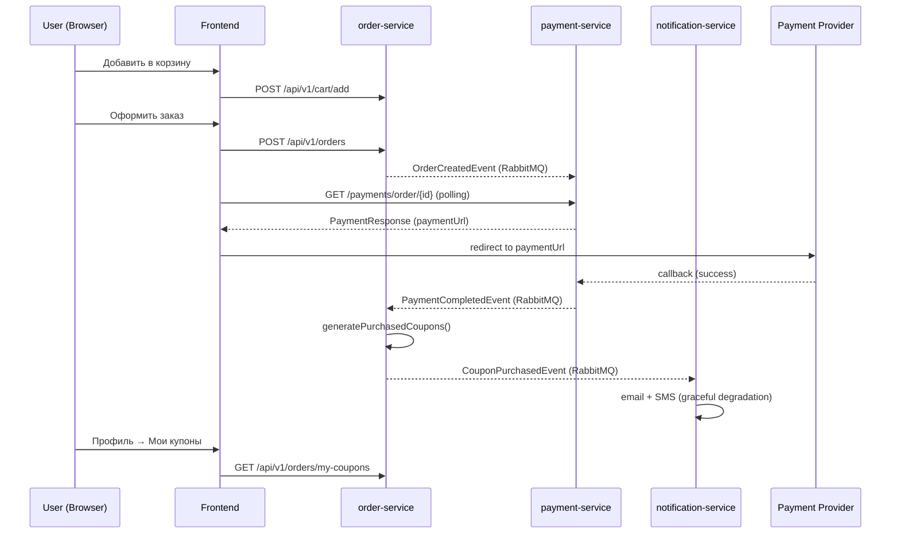

# Purchase Flow — Implementation Walkthrough

## Обзор

Полная реализация E2E purchase flow для платформы TopDim. Все **9 из 9 этапов** завершены.

---

## Архитектура (итоговая)

---

## Изменённые файлы

### Backend (order-service)
| Файл | Действие | Описание |
|------|----------|----------|
| `dto/CartResponse.java` | NEW | Storefront-safe DTO для корзины |
| `dto/OrderResponse.java` | NEW | Storefront-safe DTO для заказа |
| `service/OrderService.java` | MODIFIED | Mapper методы для DTO |
| `controller/OrderController.java` | MODIFIED | Возвращает DTOs вместо entities |

### Backend (payment-service)
| Файл | Действие | Описание |
|------|----------|----------|
| `config/RabbitMQConfig.java` | MODIFIED | order.exchange + queue + binding |
| `listener/OrderCreatedListener.java` | NEW | Слушает OrderCreatedEvent → createPayment |
| `controller/PaymentController.java` | MODIFIED | PaymentResponse DTO + graceful 404 |
| `service/PaymentService.java` | MODIFIED | Optional findByOrderId + import |

### Frontend (web-app)
| Файл | Действие | Описание |
|------|----------|----------|
| `store/cartStore.ts` | MODIFIED | Dual-mode (guest/auth), GUEST_CART_LIMIT=5 |
| `store/authStore.ts` | MODIFIED | Cart sync on login/logout/reload |
| `api/orders.ts` | MODIFIED | OrderResponse, CartItem types |
| `api/payments.ts` | MODIFIED | PaymentResponse, getByOrderId |
| `pages/CheckoutPage.tsx` | MODIFIED | Auth-only, email+phone из профиля |
| `pages/PaymentPage.tsx` | NEW | Polling UI с 5 состояниями |
| `pages/PaymentPage.css` | NEW | Стили для payment states |
| `pages/ProfilePage.tsx` | MODIFIED | Убраны mocks, QR→ПИН-код |
| `App.tsx` | MODIFIED | Route /payment/:orderId |

### Документация
| Файл | Действие |
|------|----------|
| `docs/archive/implemented/execution-status.md` | Обновлён (9/9 stages done) |
| `docs/qa/purchase-flow-checklist.md` | NEW |

---

## Ключевые решения

1. **DTOs вместо JPA entities** — предотвращает `LazyInitializationException` и утечку внутренней структуры
2. **Event-driven payment** — `OrderCreatedEvent` → `OrderCreatedListener` с idempotency check
3. **Dual-mode cart** — `guest` (localStorage, limit 5) / `auth` (backend API)
4. **Backward-compatible `items`** — существующие компоненты не ломаются при рефакторинге
5. **Graceful 404 polling** — frontend обрабатывает 404 как "ещё не создан", не как ошибку
6. **Auth-only checkout** — guest purchase path полностью отключен
7. **Notification degradation** — `enabled: false` → stub mode, не ломает purchase status

---

## Статус

> **Все 9 этапов завершены. 0 blockers. QA checklist готов.**
